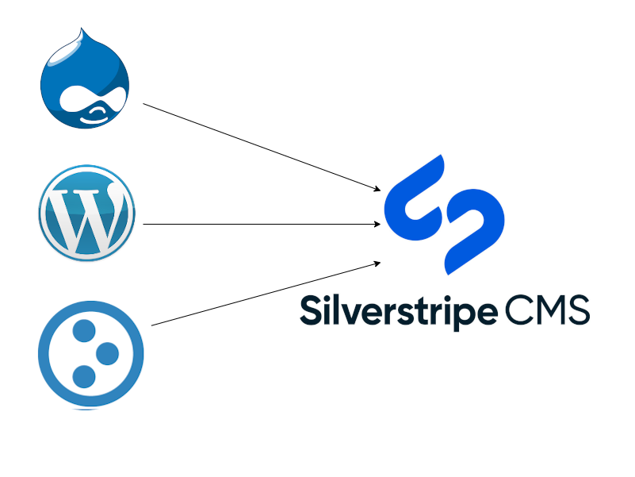

# Silverstripe Exodus

[](https://github.com/phptek/silverstripe-exodus/actions/workflows/ci.yml)
[](https://scrutinizer-ci.com/g/phptek/silverstripe-exodus/?branch=master)
[](https://github.com/phptek/silverstripe-exodus/blob/master/LICENSE.md)


## Introduction

Exodus is a content migration tool that follows the ETL standard ([**Extract Transform Load**](https://en.wikipedia.org/wiki/Extract,_transform,_load)). It will consume content from virtually any website, regardless of its underlying CMS technology and import it as native content objects (`SiteTree`, `File` etc) into a Silverstripe instance.

Exodus crawls the source website's DOM and caches matching URLs to the local filesystem. It will then normalise page-URLs by stripping file-extensions, slashes and implementation-specific strings and run a site-scrape which imports content as native Silverstripe objects into your site-tree and assets hierarchy.

Please [See the docs index](./docs/en/index.md).



## How it works

**Extract** is analogous to the module's "Crawl" mode. Given a URL, the tool will crawl the target website and cache a collection of matching URLs to the local filesystem.

**Transform** is the process of normalising the URLs cached in crawl mode and which are unique to the source system (Drupal, Wordpress or Plone). This is automatic and occurs with the selection made in the main "URL Processing" selection. This may be trial and error until the crawl process completes.

**Load** is analogous to the module's "Import" mode and is where the hard work of tweaking your crawl settings pays off, allowing you to import the content located at each cached URL into your site-tree and assets store.

Please [See the docs index](./docs/en/index.md).

## Migration

Please [See the migration docs](./docs/en/index.md).

## Requirements

* PHP ^7||^8
* silverstripe/cms ^4
* silverstripe/reports ^4
* symbiote/silverstripe-queuedjobs ^4

## Installation

```
composer require phptek/silverstripe-exodus
```

Please see the included [Migration](docs/en/howto.md) document, that describes exactly how to configure the tool to perform a content migration.

Please [See the docs](./docs/en/index.md).

## History

This module was originally written in 2012 by then Silverstripe Ltd CEO [Sam Minnee](https://github.com/sminnee/) and was known as the "Static Site Connector" module. It was used successfully on dozens of occassions to import content for new Silverstripe projects being built by the company at that time and was subsequently improved upon over the years by other Silverstripe employees.

Around 2015-2016 the module was archived by Sam and subsequently picked-up and improved by [Russell Michell](https://github.com/phptek/).

In 2022 Russell saw a need for the tool again for an upcoming gig and modified it once again to work with Silverstripe v4.

## Contributers

In order of no. commits:

* [Russell Michell](https://github.com/phptek/)
* [Sam Minnee](https://github.com/sminnee/)
* [Stig Lindqvist](https://github.com/stojg)
* [Mike Parkhill](https://github.com/mparkhill)

Credit also goes to [Marcus Nyholt](https://github.com/nyeholt/) for the use of the External Content module on top of which Exodus itself is built. The module in its current state actually includes the [`nyeholt/silverstripe-external-content`](https://github.com/nyeholt/silverstripe-external-content) package and bakes it in as a sub-directory rather than using Composer.

...it was just easier that way.

## Support Me

If you like what you see, support me! I accept Bitcoin:

<table border="0">
    <tr border="0">
        <td rowspan="2" border="0">
            
        </td>
    </tr>
    <tr border="0">
        <td border="0">
            <b>3KxmqFeVWoigjvXZoLGnoNzvEwnDq3dZ8Q</b>
        </td>
    </tr>
</table>
<p>&nbsp;</p>
<p>&nbsp;</p>

